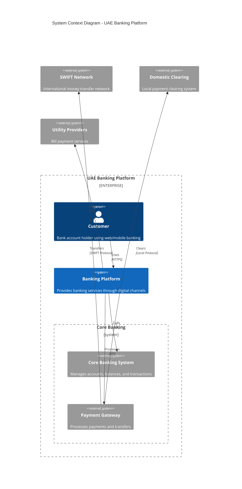

```mermaid
C4Context
    title System Context Diagram - UAE Banking Platform

    Enterprise_Boundary(b0, "UAE Banking Platform") {
        Person(customer, "Customer", "Bank account holder using web/mobile banking")
        System(banking_system, "Banking Platform", "Provides banking services through digital channels")
        
        Boundary(core_systems, "Core Banking") {
            System_Ext(core_banking, "Core Banking System", "Manages accounts, balances, and transactions")
            System_Ext(payment_gateway, "Payment Gateway", "Processes payments and transfers")
        }
    }

    System_Ext(swift, "SWIFT Network", "International money transfer network")
    System_Ext(domestic_clearing, "Domestic Clearing", "Local payment clearing system")
    System_Ext(utility_providers, "Utility Providers", "Bill payment services")

    Rel(customer, banking_system, "Uses", "HTTPS")
    Rel(banking_system, core_banking, "Calls", "API")
    Rel(banking_system, payment_gateway, "Processes", "API")
    Rel(payment_gateway, swift, "Transfers", "SWIFT Protocol")
    Rel(payment_gateway, domestic_clearing, "Clears", "Local Protocol")
    Rel(banking_system, utility_providers, "Pays", "API")
```
