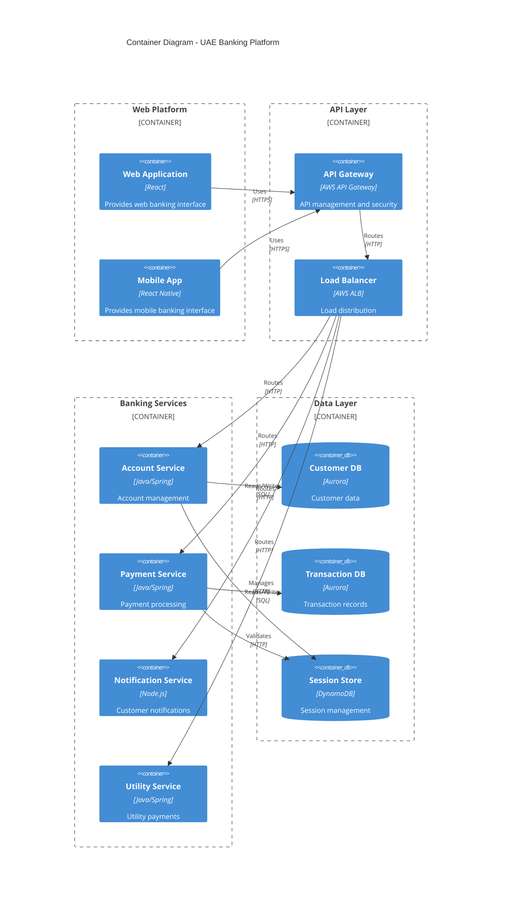

```mermaid
C4Container
    title Container Diagram - UAE Banking Platform

    Container_Boundary(web, "Web Platform") {
        Container(web_app, "Web Application", "React", "Provides web banking interface")
        Container(mobile_app, "Mobile App", "React Native", "Provides mobile banking interface")
    }

    Container_Boundary(api, "API Layer") {
        Container(api_gateway, "API Gateway", "AWS API Gateway", "API management and security")
        Container(load_balancer, "Load Balancer", "AWS ALB", "Load distribution")
    }

    Container_Boundary(services, "Banking Services") {
        Container(account_svc, "Account Service", "Java/Spring", "Account management")
        Container(payment_svc, "Payment Service", "Java/Spring", "Payment processing")
        Container(notification_svc, "Notification Service", "Node.js", "Customer notifications")
        Container(utility_svc, "Utility Service", "Java/Spring", "Utility payments")
    }

    Container_Boundary(data, "Data Layer") {
        ContainerDb(customer_db, "Customer DB", "Aurora", "Customer data")
        ContainerDb(transaction_db, "Transaction DB", "Aurora", "Transaction records")
        ContainerDb(session_db, "Session Store", "DynamoDB", "Session management")
    }

    Rel(web_app, api_gateway, "Uses", "HTTPS")
    Rel(mobile_app, api_gateway, "Uses", "HTTPS")
    Rel(api_gateway, load_balancer, "Routes", "HTTP")
    Rel(load_balancer, account_svc, "Routes", "HTTP")
    Rel(load_balancer, payment_svc, "Routes", "HTTP")
    Rel(load_balancer, notification_svc, "Routes", "HTTP")
    Rel(load_balancer, utility_svc, "Routes", "HTTP")
    
    Rel(account_svc, customer_db, "Reads/Writes", "SQL")
    Rel(payment_svc, transaction_db, "Reads/Writes", "SQL")
    Rel(account_svc, session_db, "Manages", "HTTP")
    Rel(payment_svc, session_db, "Validates", "HTTP")
```
