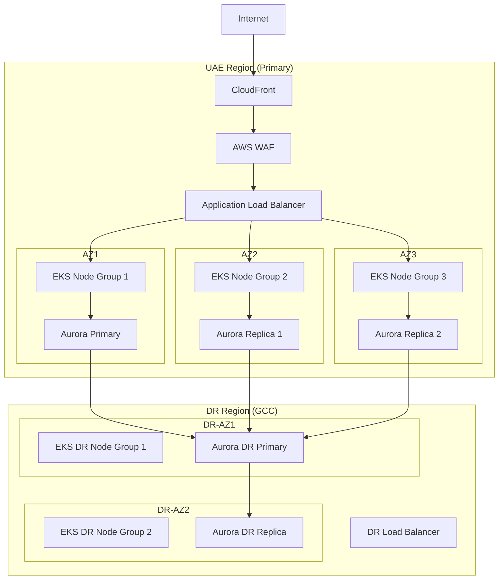

```mermaid
graph TB
    subgraph "UAE Region (Primary)"
        subgraph "AZ1"
            EKS1["EKS Node Group 1"]
            Aurora1["Aurora Primary"]
        end
        subgraph "AZ2"
            EKS2["EKS Node Group 2"]
            Aurora2["Aurora Replica 1"]
        end
        subgraph "AZ3"
            EKS3["EKS Node Group 3"]
            Aurora3["Aurora Replica 2"]
        end
        ALB["Application Load Balancer"]
        WAF["AWS WAF"]
        CFront["CloudFront"]
    end

    subgraph "DR Region (GCC)"
        subgraph "DR-AZ1"
            EKS_DR1["EKS DR Node Group 1"]
            Aurora_DR1["Aurora DR Primary"]
        end
        subgraph "DR-AZ2"
            EKS_DR2["EKS DR Node Group 2"]
            Aurora_DR2["Aurora DR Replica"]
        end
        ALB_DR["DR Load Balancer"]
    end

    Internet["Internet"] --> CFront
    CFront --> WAF
    WAF --> ALB
    ALB --> EKS1
    ALB --> EKS2
    ALB --> EKS3
    
    EKS1 --> Aurora1
    EKS2 --> Aurora2
    EKS3 --> Aurora3
    
    Aurora1 --> Aurora_DR1
    Aurora2 --> Aurora_DR1
    Aurora3 --> Aurora_DR1
    
    Aurora_DR1 --> Aurora_DR2
```
